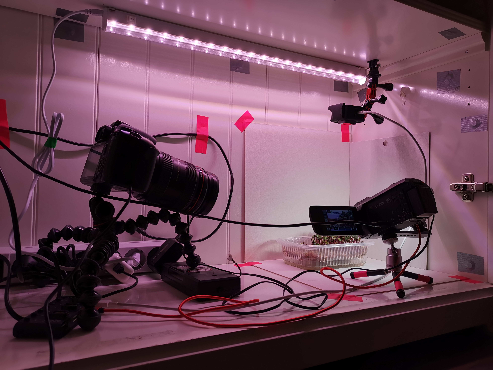

# Useful-Scripts-For-Timelapses

## Backstory
This repository is my collection of scripts & code for filming great time-lapses.  
My experience with time-lapses started by filming clever mould [Physarum Polycephalum.](https://en.wikipedia.org/wiki/Physarum_polycephalum#:~:text=Physarum%20polycephalum%2C%20an%20acellular%20slime,forms%20and%20broad%20geographic%20distribution.&text=polycephalum%20is%20used%20as%20a,compatibility%2C%20and%20the%20cell%20cycle.)
It grows in a very interesting way, creating a road network to transmit food in itself.

Then, to vary a little, I decided to film some plants (microgreens specifically). It takes more time to grow, however it is far easier to work with, because Physarum is a complete nightmare in terms of choosing the best temperature, humidity, keeping petri dish as clean as possible and managing many other problems as well.
In the future, I think of growing some mushrooms because they're cool (and there are a lot of different kinds)

## Repository contents
### Server to manage everything
In my setup I have a stationary computer running Linux for all the software & scripts needed to capture photos. That is much better, because:  
* Not all cameras can independently record time-lapse video to internal SD card (My Canon camera for instance, and Panasonic having a 12-hour time limit on a timelapse, which is really annoying)  
* I have a home NAS (Network Access Share) and this way all photos get saved directly to NAS, and I don't have to dump SD cards to it.

### Cameras
Camera-wise, I have Canon EOS camera connected via mini USB to PC (using their freshly released Canon EOS webcam utility (gPhoto for Linux) ), Panasonic Camera connected via HDMI & capture card and GoPro Hero 5 shooting timelapse to its internal storage. I'm planning to connect GoPro to pc via HDMI & capture card as well to be able to monitor picture on another device (which gives me a lot more control over quality)

### Usage
* To take pictures from a camera connected via capture card, run `./panasonic/panasonic_capture.sh`  
* To take pictures from Canon EOS camera, run `./canon/canon_capture.sh`. This will properly take a picture in the highest quality, but the camera will make a sound. Therefore, you might consider shooting in a separate room (or just get used to it, as I did :) )

